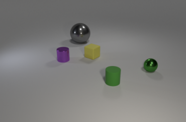
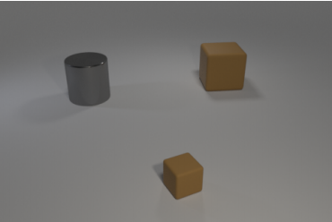

# VQA on CLEVR Dataset

Solution of a Kaggle challenge regarding Visual Question-Answering with the CLEVR dataset.

### Task

Solve a visual question answering (VQA) problem on the proposed dataset, which contains synthetic scenes composed by several objects (see examples above) and corresponding questions about the existence of something in the scene (e.g., Is there a yellow thing?') or about counting (e.g., How many big objects are there?') . Given an image and a question, the goal is to provide the correct answer.

#### Examples:

**Q**: Is there anything else that is the same shape as the tiny yellow matte thing?

**A**: no

**Q**: What number of other matte objects are the same shape as the small rubber object?

**A**: 1

### Notes

In this repository are stored a Python files for utility functions ( for standard tasks such as loading data, generation of results, plot of some predictions, etc.) and a Jupyter Notebook containing the solution and the though-process behind it.

The Notebook is meant to run on the Kaggle platform taking advantage of the GPU acceleration for increasing training speed. Note that also the file structure and the location of the data mimics Gaggle’s. If you want to run it yourself you need to download the data and fix the path/to/data in the script of utility functions.

## Further Improvements

- Add attention mechanism for improving accuracy
